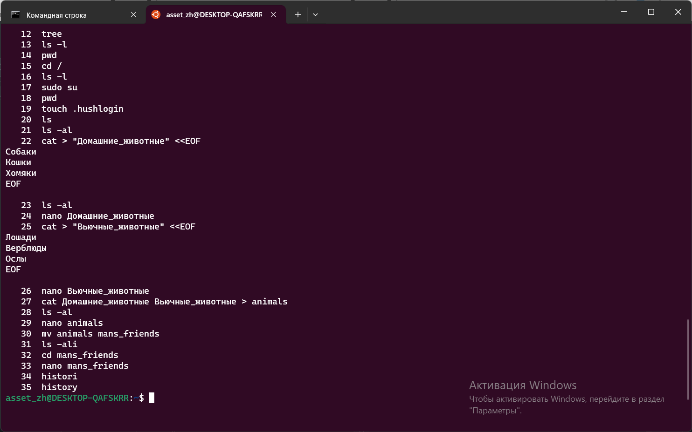
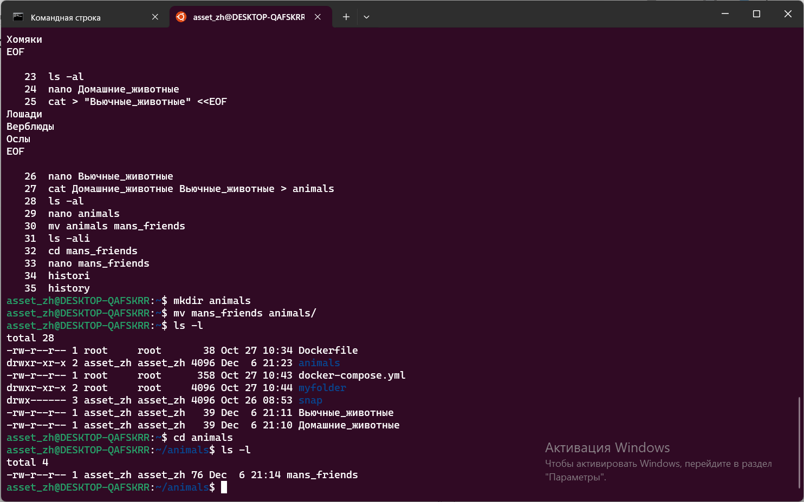
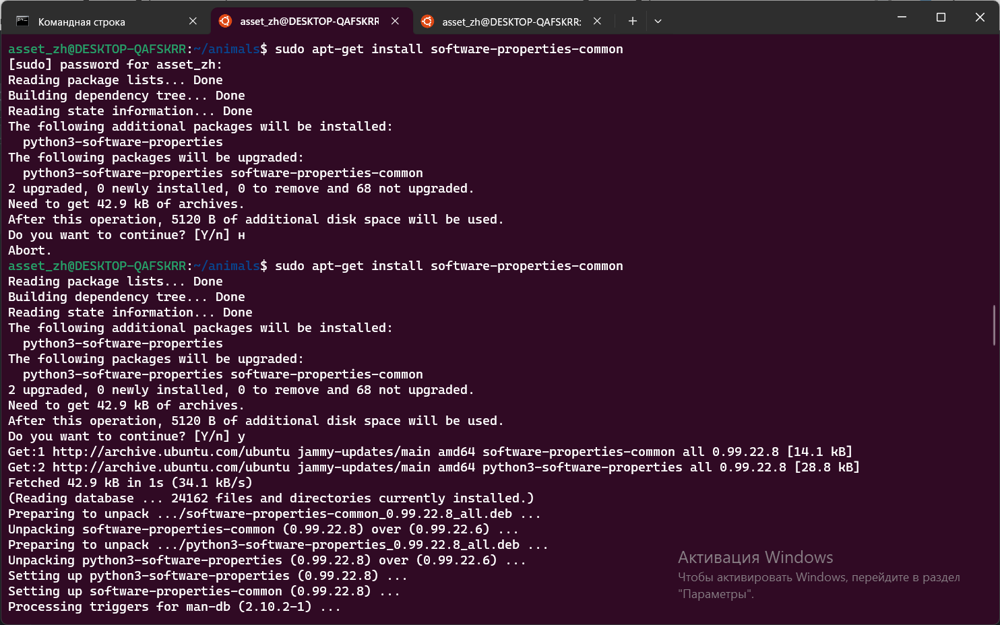
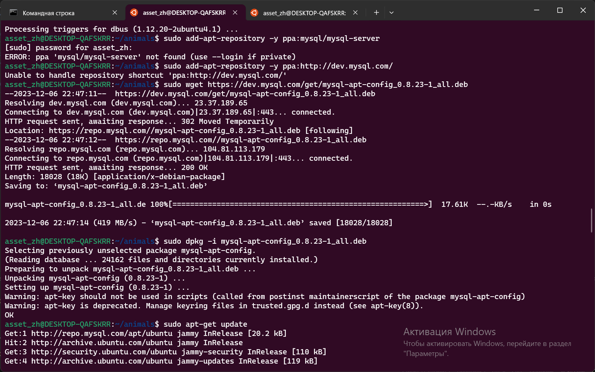
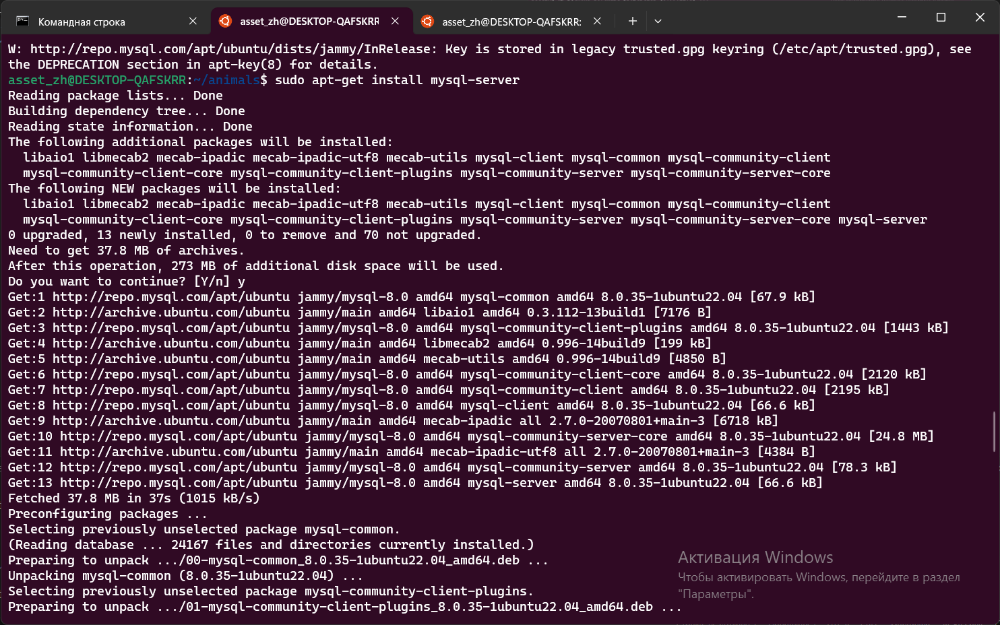
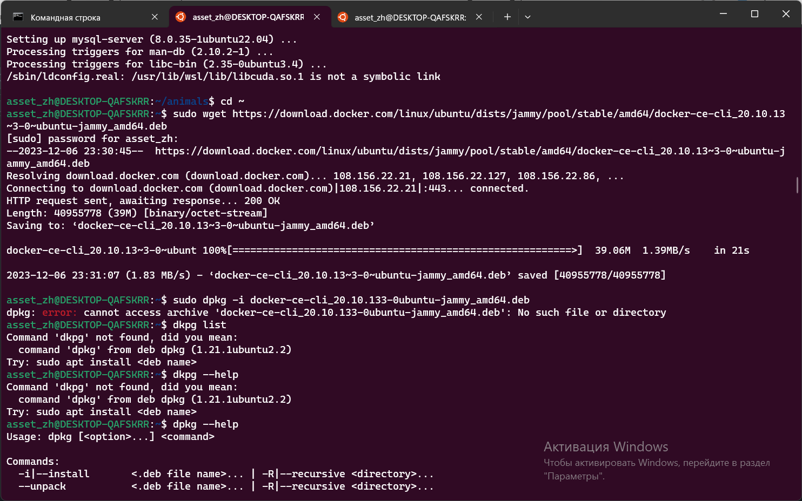
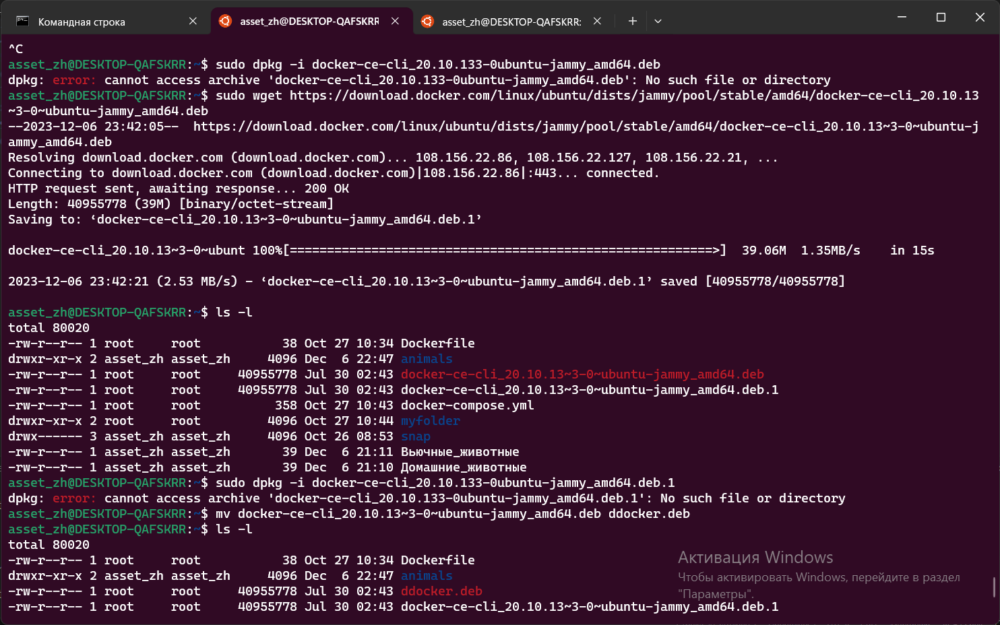
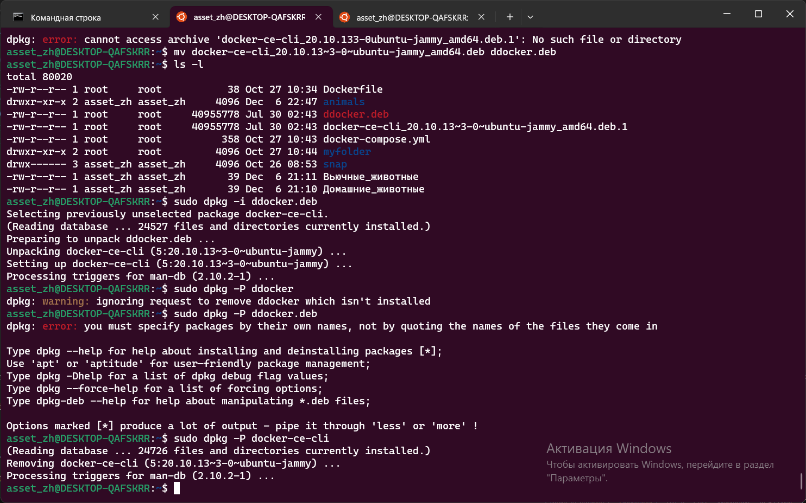

# Информация о проекте

Необходимо организовать систему учета для питомника, в котором живут домашние и вьючные животные.

# Задание

1. Используя команду cat в терминале операционной системы Linux, создать
два файла Домашние животные (заполнив файл собаками, кошками,
хомяками) и Вьючные животными заполнив файл (Лошадьми, верблюдами и
ослы), а затем объединить их. Просмотреть содержимое созданного файла.
Переименовать файл, дав ему новое имя (Друзья человека).

2. Создать директорию, переместить файл туда.

3. Подключить дополнительный репозиторий MySQL. Установить любой пакет
из этого репозитория.

4. Установить и удалить deb-пакет с помощью dpkg.

5. Выложить историю команд в терминале ubuntu

asset_zh@DESKTOP-QAFSKRR:~$ history

   21  ls -al
  
  22  cat > "Домашние_животные" <<EOF
Собаки
Кошки
Хомяки
EOF

   23  ls -al
   
   24  nano Домашние_животные
   
   25  cat > "Вьючные_животные" <<EOF
Лошади
Верблюды
Ослы
EOF

   26  nano Вьючные_животные
   
   27  cat Домашние_животные Вьючные_животные > animals
   
   28  ls -al
   
   29  nano animals
   
   30  mv animals mans_friends
   
   31  ls -ali
   
   32  cd mans_friends
   
   33  nano mans_friends
   
   36  mkdir animals
   
   37  mv mans_friends animals/
   
   38  ls -l
   
   39  cd animals
   
   40  ls -l
   
   41  sudo apt-get update
   
   42  sudo apt-get install software-properties-common
   
   43  sudo add-apt-repository -y ppa:mysql/mysql-server
   
   44  sudo add-apt-repository -y ppa:http://dev.mysql.com/
   
   45  sudo wget https://dev.mysql.com/get/mysql-apt-config_0.8.23-1_all.deb
   
   46  sudo dpkg -i mysql-apt-config_0.8.23-1_all.deb
   
   47  sudo apt-get update
   
   48  sudo apt-get install mysql-server
   
   49  cd ~
   
   50  sudo wget https://download.docker.com/linux/ubuntu/dists/jammy/pool/stable/amd64/docker-ce-cli_20.10.13~3-0~ubuntu-jammy_amd64.deb
   
   51  sudo dpkg -i docker-ce-cli_20.10.133-0ubuntu-jammy_amd64.deb
   
   61  sudo dpkg -i docker-ce-cli_20.10.133-0ubuntu-jammy_amd64.deb
   
   62  sudo wget https://download.docker.com/linux/ubuntu/dists/jammy/pool/stable/amd64/docker-ce-cli_20.10.13~3-0~ubuntu-jammy_amd64.deb
   
   63  ls -l
   
   64  sudo dpkg -i docker-ce-cli_20.10.133-0ubuntu-jammy_amd64.deb.1
   
   65  mv docker-ce-cli_20.10.13~3-0~ubuntu-jammy_amd64.deb ddocker.deb
   
   66  ls -l
   
   70  sudo dpkg -P docker-ce-cli
   
   71  history

